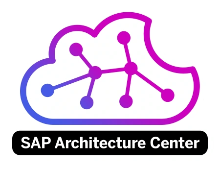

[](https://api.reuse.software/info/github.com/SAP/architecture-center) [](https://github.com/SAP/architecture-center/actions/workflows/deploy-manual.yml) [](https://github.com/SAP/architecture-center/actions/workflows/periodic-link-watcher.yml) [](https://github.com/SAP/architecture-center/actions/workflows/github-code-scanning/codeql)



# [SAP Architecture Center](https://architecture.learning.sap.com)

Reference architectures are templates in their simplest form. They generalize specific implementations of software with a common set of components, vocabulary, or configuration. In the SAP context, this means showing how applications, data, and AI operate at the product and service level, and how you can take advantage of repeatable best practices to optimize your SAP cloud and on-premises investments.

A reference architecture outlines the interactions between various services, showcasing how they work together seamlessly. It also demonstrates how these services integrate with business applications from SAP, partners, and third-party providers. This holistic view helps organizations understand the components needed to build a cohesive and efficient system. These templates provide a standardized approach to designing systems, ensuring best practices and optimal configurations are followed. They can easily be customized or adapted to a customer's unique environment and provide a foundation for adopting the latest cloud innovations from SAP.

## Requirements and Setup

### Prerequisites

- **Node.js** >= 20.0
- **npm** or **pnpm**
- **Git**

### Local Development Setup

#### 1. Clone the Repository

```bash
git clone https://github.com/SAP/architecture-center.git
cd architecture-center
```

#### 2. Install Dependencies

```bash
npm install
```

#### 3. Start Development Server

```bash
npm start
```

This will start the Docusaurus development server. Open http://localhost:3000 in your browser to view the site.

The development server supports hot reloading - changes to source files will automatically refresh the browser.

#### 4. Build for Production

```bash
npm run build
```

This generates static content in the `build` directory that can be served by any static hosting service.

#### 5. Run Linting

```bash
npm run lint          # Check for linting errors
npm run lint:fix      # Auto-fix linting errors
```

#### 6. Security Audit

```bash
npm run security:audit        # Check production dependencies for vulnerabilities
npm run security:audit-fix    # Automatically fix vulnerabilities where possible
npm run security:check        # Run audit and check for outdated packages
npm run security:update       # Update packages and fix vulnerabilities
```

**Note**: The security audit checks only production dependencies (excludes devDependencies) to focus on what gets deployed.

For detailed contribution guidelines, refer to the [Community of Practice | Intro](docs/community/intro.md). 

## Support, Feedback, Contributing

This project is open to feature requests/suggestions, bug reports etc. via [GitHub issues](https://github.com/SAP/architecture-center/issues). Contribution and feedback are encouraged and always welcome. For more information about how to contribute, the project structure, as well as additional contribution information, see our [Contribution Guidelines](CONTRIBUTING.md).

## Security / Disclosure
If you find any bug that may be a security problem, please follow our instructions at [in our security policy](https://github.com/SAP/architecture-center/security/policy) on how to report it. Please do not create GitHub issues for security-related doubts or problems.

## Code of Conduct

We as members, contributors, and leaders pledge to make participation in our community a harassment-free experience for everyone. By participating in this project, you agree to abide by its [Code of Conduct](https://github.com/SAP/.github/blob/main/CODE_OF_CONDUCT.md) at all times.

## Licensing

Copyright 2025 SAP SE or an SAP affiliate company and architecture-center contributors. Please see our [LICENSE](LICENSE) for copyright and license information. Detailed information including third-party components and their licensing/copyright information is available [via the REUSE tool](https://api.reuse.software/info/github.com/SAP/architecture-center).
