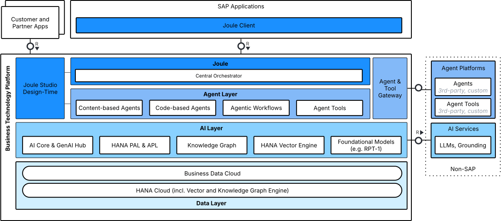
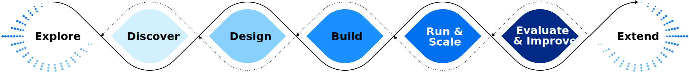

The **SAP's AI Golden Path** is the starting point for developing AI applications across the SAP ecosystem. It contains **recommendations**, **best practices**, and **tutorials** to help you understand the AI technology stack, identify
suitable tools and services, and design, deliver, and extend enterprise-grade AI solutions on SAP technology.

It serves as a central entry point into our approach for building AI-native applications, covering everything from data
and AI foundation services to agentic architectures and **Joule**.

## Is This Guide for You?

* If you're an **architect or AI project lead**, this guide helps you to plan the architecture of your AI application
  and choose the right AI capabilities, data layers, and runtime services within the SAP ecosystem.

* If you're a **developer**, this guide helps you to select the appropriate tools, SDKs, and frameworks for building and
  integrating AI features.

* If you're a **product manager**, this guide helps you to understand the AI development lifecycle, available technologies, and best practices for delivering AI use cases.

## References

Before starting your AI development journey, you may want to familiarize yourself with the following documents:

* **[SAP BTP Developer Guide](https://help.sap.com/docs/btp/btp-developers-guide/btp-developers-guide)**
  Starting point for developing business applications on SAP Business Technology Platform (BTP). It contains recommendations and best practices for
  development projects on SAP BTP.

## How to Use This Guide

Use this guide to navigate the **AI development lifecycle**, from understanding the available technology to implementing
and scaling AI use cases.

### Understand Available Technology

The first step toward building an AI application is understanding the **technology stack** available within SAP. This
includes:

* **Agent Layer** — including content-based AI Agents built with **Joule Studio**, code-based AI Agents built with  open-source frameworks and SAP's **generative AI hub**, **Joule**, and **agent tools (MCP)**.
* **AI Layer** — powered by **AI Core** (including **generative AI hub**), and **SAP HANA Cloud** (including Vector Engine, Knowledge Graph Engine, PAL, SparkML), enabling model training, orchestration, and interaction
  through generative and agentic interfaces.
* **Data Layer** — powered by **SAP HANA Cloud**, **Business Data Cloud**, and partner
  technologies like **Databricks** and **Snowflake** for advanced analytics and data science.

See [Technology Decision Tree](./1-technology-overview/readme.md) for details.

### Select the Right AI Approach

Choosing the correct AI approach depends on the use case and business problem:

* **Agentic Workflows & AI Agents** – Context-aware automation, orchestration, and dynamic decision-making.
* **Generative AI & LLMs** – Natural language, summarization, and conversational use cases.
* **Classic Machine Learning (ML) on AI Core** – Predictive analytics, optimization, classification.
* **Relational Foundation Models** – Structured data, tabular predictions.

See [Decide on an approach](./1-technology-overview/readme.md) for detailed recommendations.

### Develop AI Use Cases

AI development follows a **design-led, iterative process** that ensures business value and technical feasibility. This
guide structures recommendations across the key development phases:

This guide mainly focuses on the **Design**, **Deliver**, and **Run & Scale** phases.

* **Explore, Discover** — Identify business challenges suitable for AI, evaluate feasibility, and define success
  metrics or evaluations (evals).
* **Design** — Create an AI architecture and decide between ML, LLM, or agentic approaches.
* **Deliver** — Set up the environment (SAP BTP, Joule, AI Core), develop and deploy AI applications, and integrate them
  into existing processes.
* **Run & Scale** — Run the application to provide business value.
* **Evaluate & Improve** — Measure accuracy, performance, and business outcomes; continuously enhance through structured
  evaluations.
* **Extend** — Build on top of existing applications or agents, integrating with partner ecosystems and third-party
  solutions.

Get started with building in the [Build and Deliver](./2-build-and-deliver/2-classic-ml/readme.md) section.