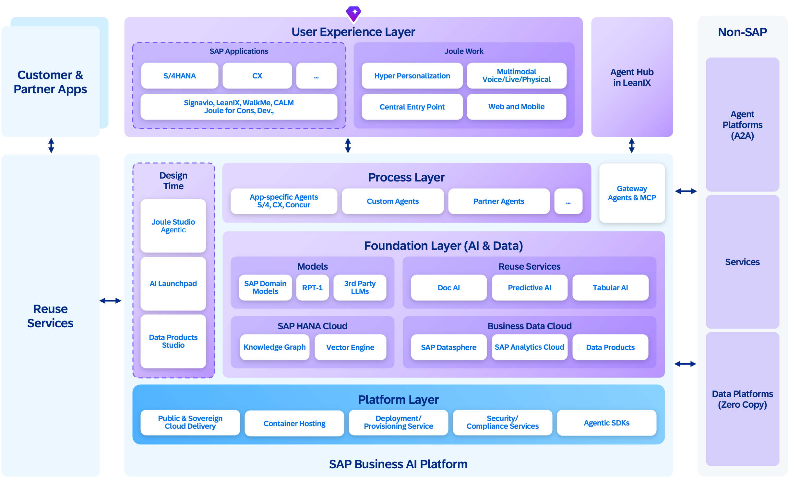
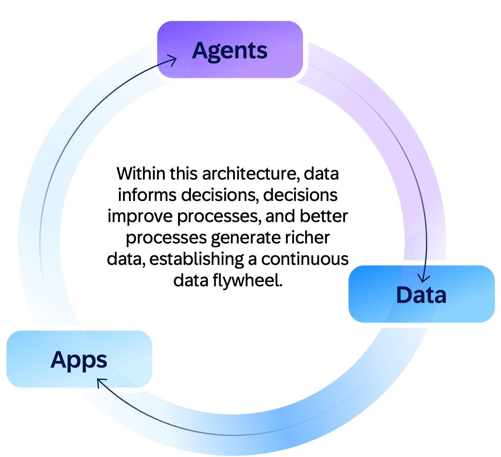
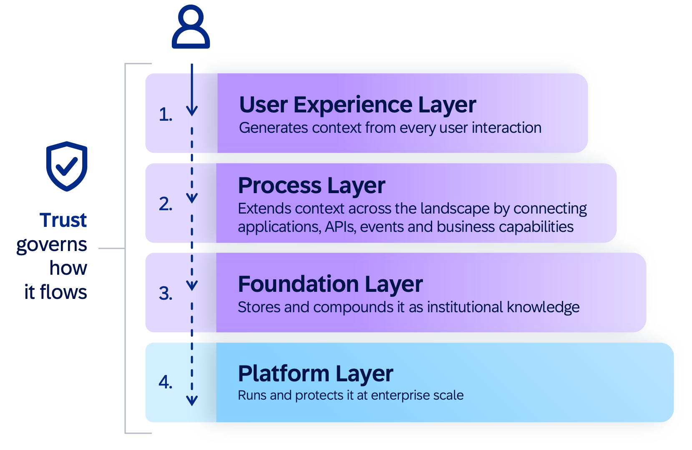
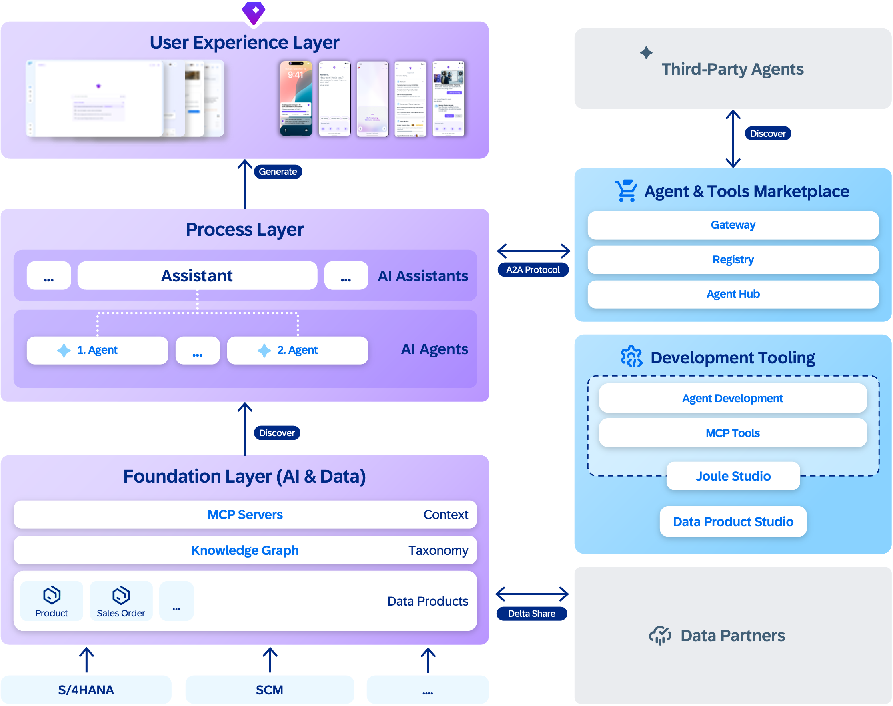

The AI-native architecture from SAP rests on three simple premises: 
- Models that reason are the baseline. 
- Context - grounding AI in business data and semantics, is what makes reasoning relevant. 
- Agents that plan, act, and learn turn this into outcomes. 

The four architectural layers that make up the AI-native North Star architecture from SAP deliver all three.

The four layers are as follows:

- The **user experience layer** evolves from static to adaptive. The Joule solution becomes the central engagement layer across the SAP Autonomous Suite, shifting interaction from app navigation to intent-driven execution across multiple channels. Interfaces become contextual, multimodal, and generative.
- The **process layer** evolves from predefined to agentic. Applications become capability providers for agents that plan and execute processes across SAP, partner, and third-party systems and agents through a governed gateway. A unified design-time environment supports building both applications and agents from business intent to production.
- The **foundation layer** evolves from a system of record to a system of context. Data and AI, enabled by the SAP Business Data Cloud and SAP Knowledge Graph solutions, create context-rich, semantically grounded enterprise intelligence.
- The **platform layer** evolves from hosting applications to running SAP-managed enterprise agents integrated across the customer landscape. The platform provides the runtime, sandbox, observability, and governance that turn stateless AI models into reliable enterprise agents. Agent lifecycle, identity, routing, and integration are built into the platform.

These layers operate under a shared set of design principles: 

- Design for AI-native consumption.
- Enable proactive intelligence.
- Contribute to a unified knowledge graph.
- Design for orchestration.
- Build on platform services and open standards.
- Help ensure trust is nonnegotiable.
- Design for resilience.
- Enable continuous learning.

### How each layer plays a distinct role in the system of context:

<ul>
<li> The <b>experience layer</b> generates context from each user interaction.</li>
<li> The <b>process layer</b> extends it across the landscape by connecting applications, APIs, events, and business capabilities, allowing agents to reason across them.</li>
<li> The <b>foundation layer</b> stores and compounds this into institutional knowledge.</li>
<li> The <b>platform layer</b> runs and protects it at enterprise scale. Trust governs how this context flows across all four layers.</li>
</ul>

### How users experience it

The four layers work together in each user interaction. Users switch between applications to verify data, follow up on issues, and complete processes. With an AI-native architecture, this becomes a connected, outcome-first flow in which the system not only identifies issues but also resolves them within defined business policies.

As an example, a finance analyst asks Joule to "resolve high-value disputes likely to delay payment, and minimize impact on days sales outstanding (DSO)." Joule routes the request to an agent that spans sales, ERP, and service management, with the authority to analyze, decide, and execute resolution workflows within governed boundaries.

The agent queries SAP Knowledge Graph to discover the right APIs and data products, retrieves disputes across applications that previously lacked a shared access layer, and draws on decision traces from past resolutions: which escalation paths worked, which settlement patterns reduced DSO, and which customers responded to which approaches. The agent identifies high-risk disputes, selects optimal resolution strategies based on historical outcomes, executes follow-ups such as customer communication and internal escalations, and initiates resolution workflows. Only exceptions or policy-bound decisions are routed for human approval. As disputes are resolved, payment commitments are secured and tracked through to completion, helping ensure closure rather than partial progress.

The results are a measurable reduction in DSO, faster dispute-resolution cycles, and higher recovery rates, with most cases resolved without manual intervention. The next time a similar dispute arises, the agent’s resolution strategies improve because it learned from this one. This is the system of context in action: SAP Knowledge Graph provides semantic grounding, decision traces from past resolutions inform execution, and each completed resolution feeds back as a verified outcome signal.

The example above touched every layer of the architecture. The following sections examine each one.