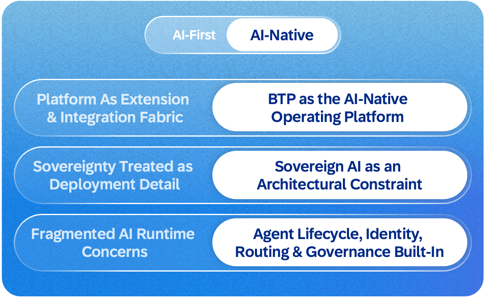
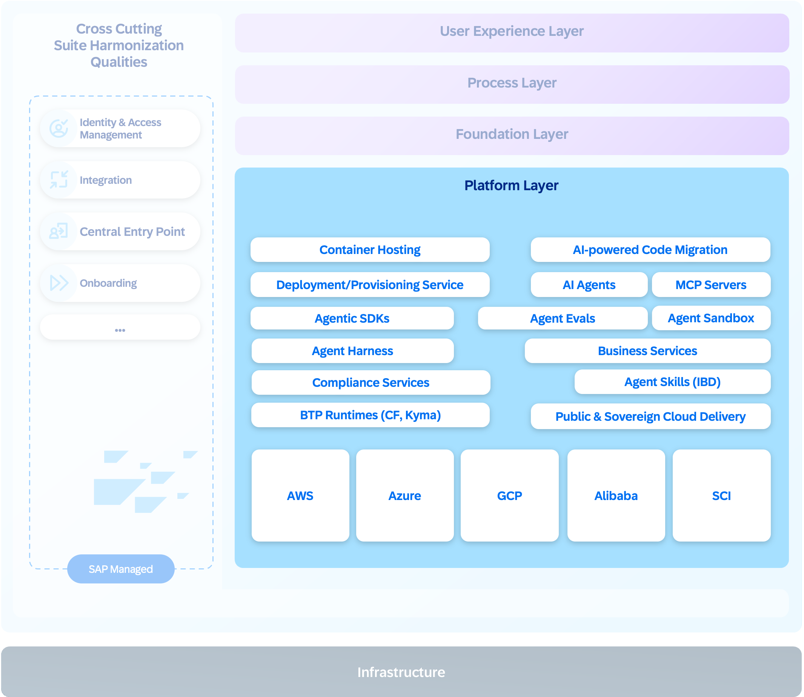

The platform layer is where applications, agents, and workflows run. SAP Business Technology Platform provides composable services across data management, application development, integration, and security. Workloads are defined declaratively. Infrastructure, dependencies, and deployment targets are captured as configuration rather than code, so the interface stays stable while the platform evolves underneath. An AI Golden Path for application development—built on SAP Cloud Application Programming Model, the ABAP Cloud development model (ABAP RESTful application programming model), and the SAP Fiori design system—delivers consistent data models, harmonized APIs, and unified lifecycle management.

With proven scalability supporting millions of tenants globally, the platform delivers the reliability, performance, sustainability, and security required for enterprise-scale AI.

The shift from AI-first to AI-native expands the platform beyond hosting applications and providing integration. It now supports both deterministic applications and adaptive agents on the same foundation, managing the full lifecycle of agents that operate across both systems of record and systems of context. Sovereign AI is an architectural constraint: agent lifecycle, identity, routing, and governance are built in from the start.

### The Managed agent runtime

SAP Business Technology Platform provides a **managed agent runtime** that provides the infrastructure to make enterprise agents reliable at scale. When an agent is created, the platform automatically enables harness capabilities such as security, observability, tenant isolation, sandboxing, and persistent memory.

The model reasons. The harness governs. Research shows that the same model performs dramatically differently depending on the system around it. The harness, not the model, determines the ceiling.

In practice, the platform is designed to provide standardized software development kits for building agents in any framework, an agent sandbox for safe development and testing, container-hosted execution, an agent skills registry for discovering reusable capabilities, and continuous evaluations for quality assurance. Each customer’s context, memory, and reasoning artifacts are strictly separated from day one, helping ensure that one organization’s business intelligence does not leak into another’s.

Extensibility is built in from the start. Customers and partners customize agents without modifying the underlying code through four patterns: tool extensibility through the Model Context Protocol, skills as reusable building blocks, pre and post extension hooks and instructions that precondition the agent’s behavior with domain knowledge and operating guidelines.

Observability is built on **OpenTelemetry**, covering agent execution end to end with traces, logs, and metrics. With transparent tracking of model calls, enterprises gain full visibility into AI costs, environmental impacts, and adoption. Without these capabilities, a large language model is just a text generator. With this harness, the system becomes a reliable enterprise agent.

A platform that runs autonomous agents must also govern them. As agents start to act across systems and organizational boundaries, SAP treats trust, security, and integration as architectural prerequisites, embedded into the platform by design.

