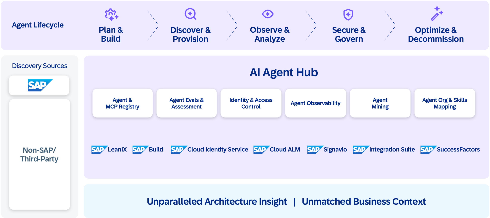

Trust makes collaboration possible. With identity, open protocols, and clear authorization boundaries in place, agents, data products, and tools can be registered, versioned, and shared across organizational boundaries. The SAP AI Agent Hub solution serves as an enterprise hub for discovering and managing agents, a marketplace where intelligent components are published, evaluated, and composed into solutions.
The Agent Hub manages the full agent lifecycle: from planning and development through discovery and provisioning to observability, governance, and optimization.

Agent mining discovers agents that already exist across the enterprise, giving organizations visibility into capabilities they may not know they have. Skills mapping connects agents to the organizational roles and business processes they serve, making sure the right agent reaches the right user. 

The ecosystem builds on three foundations. APIs and metadata, described through Open Resource Discovery (ORD), make each SAP capability discoverable and composable. Data products, governed through SAP Business Data Cloud, provide curated datasets that agents and applications can consume through standardized interfaces. SAP Knowledge Graph adds semantic grounding, enabling agents to reason across these resources rather than simply query them.

 On top of this foundation, developers, partners, and customers cocreate agents, models, and extensions that expand enterprise intelligence. Partners build domain-specific agents such as a logistics optimization agent, a regulatory compliance agent, and a demand forecasting agent and publish them to the marketplace with standardized metadata, quality metrics, and trust ratings. Customers extend agents built by SAP with their own business rules, custom data sources, and industry-specific knowledge.

Each agent in the marketplace follows the same governance model: identity management, authorization boundaries, observability, audit trails, ethics, and sustainability. Whether an agent is built by SAP, a partner, or a customer, it operates under the same trust framework.

The result is a network effect: more agents create more capabilities, more capabilities attract more builders, and the ecosystem compounds in value, mirroring the platform dynamics that defined the consumer era and now apply to enterprise intelligence.
