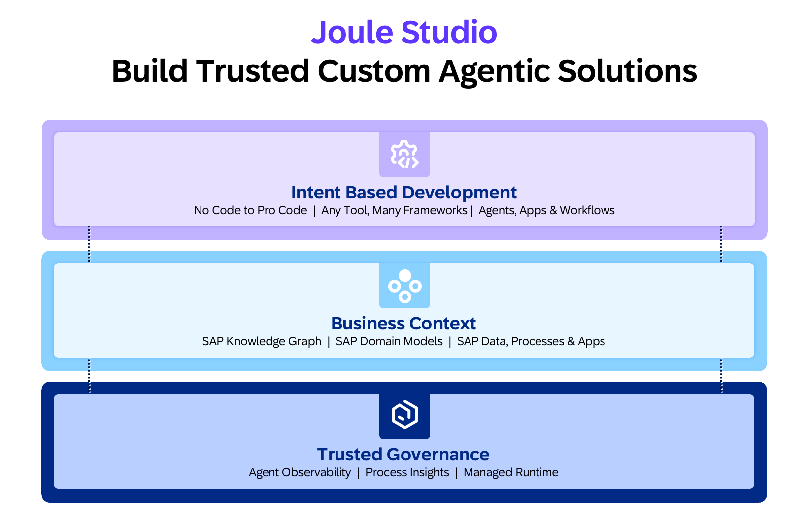

---
############################################################
#                Beginning of Front Matter                 #
############################################################
#                     [DO NOT MODIFY]                      #
############################################################
id: id-ra0024-6
slug: /ref-arch/06ff6062dc/6
sidebar_position: 6
sidebar_custom_props:
    category_index:
############################################################
#     You can modify the front matter properties below     #
############################################################
title: Joule Studio
description: SAP’s AI-first low-code and pro-code development solution for generating and running custom AI agents, workflows and extensions.
sidebar_label: Joule Studio
keywords:
- joule
- joule studio
- custom joule skills
- ai agents
- sap integration
- sap ai
- automation
- sap btp
- hybrid landscapes
image: img/ac-soc-med.png
tags:
  - genai
  - agents
  - build
  - appdev
hide_table_of_contents: false
hide_title: false
toc_min_heading_level: 2
toc_max_heading_level: 4
draft: false
unlisted: false
contributors:
  - fabianleh
  - SelinaHochstrat
  - f-buech
last_update:
  author: fabianleh
  date: 2026-05-15

############################################################
#                   End of Front Matter                    #
############################################################
---

Joule Studio enables the development of trusted, production-grade agentic solutions for the enterprise. Its design is organized around three principles.

Intent Based Development: Solutions begin with a description of the desired business outcome. Joule Studio translates that intent into working agents, applications, and workflows. The platform supports the full spectrum from no-code to pro-code and accommodates existing developer toolchains without mandating a single environment.

Business Context: Reliable agent behavior requires grounding in enterprise-specific knowledge. Joule Studio anchors agents in SAP's semantic context through the SAP Knowledge Graph, the SAP domain models, and the underlying SAP data, processes, and applications agents must reason over and act on.

Trusted Governance: Scaling agentic solutions in the enterprise requires built-in operational controls. Joule Studio provides an Agent Hub for lifecycle management of deployed agents, Process Insights for behavioral observability and impact analysis, and a Managed runtime that embeds operations, controls, and oversight as structural features — not afterthoughts.

These three principles define a path from intent, to context-grounded execution, to governed scale — ensuring agentic solutions are enterprise-ready from the point of deployment.

Joule Studio currently enables you to create the following Solution Types:    

- **Agents**: An Agent connects to SAP systems to answer questions and take actions via conversational interaction. Agents communicate with SAP backends through a secure gateway and integrate with Joule for natural-language interaction.

- **n8n Workflows**: Are automated background processes generated by Joule Studio that connect SAP systems, route approvals, and trigger actions without manual coordination. They run invisibly in response to events or schedules and are the right solution when the business need is a repeatable, structured process rather than a persistent user interface.

- **Agent Extensions**: An agent extension adds capabilities to an existing SAP standard agent without rebuilding it. Extensions can add custom tools, instructions, and pre/post-processing hooks.

- **SAP CAP Applications**: A SAP CAP Application is a full-stack enterprise web application with a data-connected backend and a browser-based user interface. Use this solution type when you need custom screens, forms, or dashboards.

## Architecture

The architecture diagram depicts the overview of Joule Studio and the interactions between its components. 

The solution architecture consists of the following key elements:

- **SAP Business AI Platform**: The SAP Business AI Platform is an AI native foundation that integrates SAP's process and industry knowledge, semantically rich business data, and enterprise-grade governance into a unified platform. It is designed to close the gap between AI potential and measurable business impact.

- **Joule Work**: Joule Work delivers an AI powered experience that redefines how work gets done. Users simply state what they want to achieve, and Joule brings together the right insights, automates repetitive tasks, and orchestrates AI agents across systems to make it happen. Joule Work is the primary interface through which end-users interact with agents developed in Joule Studio.

- **Joule Studio**: Joule Studio is the development environment for creating custom agents, workflows, and applications. It provides tools for defining agent behavior, integrating with SAP systems, and managing the lifecycle of deployed solutions.

- **Joule Studio Runtime**: The Joule Studio Runtime is a fully managed execution environment on SAP Business AI Platform. It handles provisioning, scaling, and lifecycle management, allowing development teams to focus on building and deploying solutions rather than operating infrastructure. The runtime supports enterprise-grade agents and applications, including those built with modern frameworks and extensions.

All baseline operational services — logging, audit logging, and telemetry — are provided by the runtime. Joule Studio generates the necessary instructions and landscape configurations so that solutions can be deployed directly into the runtime without manual setup.

- **SAP Cloud Identity Services**: Test and Productive tenants of SAP Cloud Identity Services manage user authentication and authorization. The Test tenant serves Development and Test stages, while the Productive tenant serves Production. Both integrate with the respective Corporate Identity Provider (Pre-Prod or Prod) for enterprise single sign-on.

## Characteristics

- **Operationalize AI**: Close the gap between AI pilots and trusted, production-grade enterprise solutions.

- **Unify the developer experience**: Provide a single surface spanning no-code, low-code, and pro-code development across agents, apps, and workflows.

- **Embed governance by design**: Make observability, lifecycle management, and security structural features of every agentic solution — not afterthoughts.

- **Centralized identity management**: SAP Cloud Identity Services tenants (Test and Productive) provide consistent authentication and authorization across all stages. Integration with Corporate Identity Providers ensures that enterprise security policies are enforced, while the test tenant enables safe validation of identity configurations before production deployment.

- **Hybrid connectivity support**: The dedicated Connectivity subaccounts per stage enable secure access to SAP S/4HANA Cloud Private Edition or on-premise systems. This ensures that Joule can interact with backend systems while maintaining the stage isolation required for proper testing and validation.

## Examples in an SAP context

**Missed Discount Analysis Agent:** The agent connects to SAP S/4HANA, retrieves unmatched invoice data, analyzes payment terms and discount windows, and returns a structured financial impact summary.

**Weekly Unmatched Invoice Alert**: The workflow executes on a defined schedule, queries SAP S/4HANA APIs, aggregates the results, and delivers a formatted email notification.

**AP Invoice Agent Extension**: The extension adds an after-processing hook that triggers an n8n workflow when matching fails.

**Manual Invoice-to-PO Matching Workspace**: The application displays data from SAP S/4HANA and Ariba, provides a drag-and-drop matching interface, and writes assignments back to the source systems.

## Services and Components

- [Joule](https://help.sap.com/docs/joule/integrating-joule-with-sap/introduction?version=CLOUD)

- [Joule Studio](https://help.sap.com/docs/business-ai-platform/joule-studio/joule-studio?version=CLOUD)

## Resources

- [Joule Studio product page](https://www.sap.com/products/artificial-intelligence/joule-studio.html)

- [Joule Studio News Article]( https://www.sap.com/topics/events/sapphire/innovation-news-guide-2026#joule-studio)

- [SAP Cloud Identity Services - Tenant Model](https://help.sap.com/docs/cloud-identity-services/cloud-identity-services/tenant-model-and-licensing?version=Cloud)
- [System Integration Guide for SAP Cloud Identity Services](https://help.sap.com/docs/cloud-identity/system-integration-guide/system-integration-guide-for-sap-cloud-identity-services?version=Cloud)

