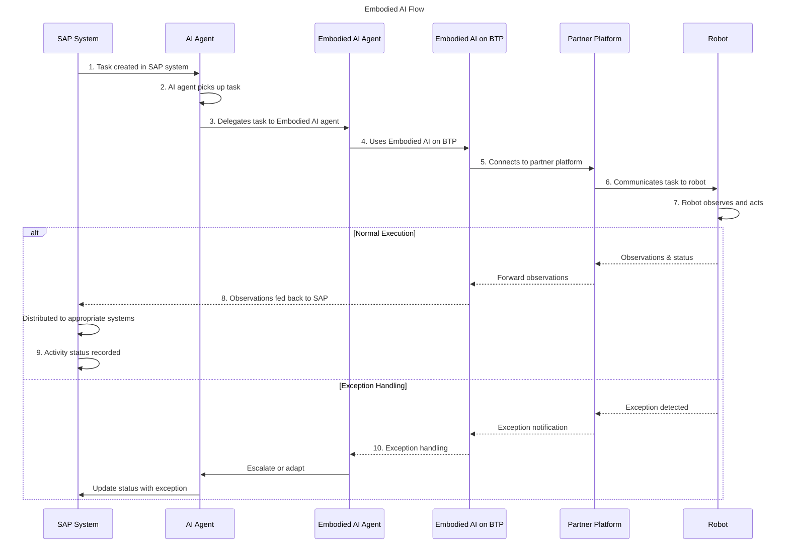

SAP's [Embodied AI architecture](https://architecture.learning.sap.com/docs/ref-arch/083f2d968e) is designed with **extensibility** and **interoperability** in mind.
These design principles are especially vital for delivering end-to-end Embodied AI due to the following factors:

1. SAP's vendor-agnostic ecosystem approach, leveraging partner technologies across hardware, software, and artificial intelligence capabilities
2. Generalizability of the architecture for different use cases, including cross-suite use cases
2. Adaptability to each customer's individual process and physical flows

:::tip Ecosystem Effect
To drive technology advances, SAP partners with [academic institutions](https://news.sap.com/japan/2026/02/sap-nagoya-university-robot-poc/) and [ecosystem partners](https://news.sap.com/2026/03/sap-utum-drive-co-innovation-embodied-ai/) worldwide.
At the same time, [open source](https://d.dam.sap.com/a/CRdeMdL/SAP_Open_Source_Report_2025.pdf?rc=10&inline=true&doi=SAP1270985) is another major factor, acting as a multiplier and making the technology more accessible.
:::

## Architecture

Within the **Embodied AI** architecture diagram, the specific components relevant to extensibility are highlighted.

## Key Components

### Trigger

To be suitable for various customer use cases, Embodied AI can be triggered via **system triggers**.
An example of a system trigger is a warehouse task created event.

Embodied AI can also be triggered on-demand via **human triggers**, meaning an interaction between a business user.

**Digital AI agents** can work together with **embodied AI agents** to accomplish tasks within the business process that span both the physical and digital world.

### Custom Fleet Connectors

The consumer of the Embodied AI on BTP service also plays a critical role in extensibility.

Custom **fleet connectors** can be deployed in order to hook up to various third-party systems, configured as destinations using the [SAP Destination Service](https://discovery-center.cloud.sap/serviceCatalog/destination-service).

:::info Embodied AI Availability
The Embodied AI on BTP service is currently only indirectly available within SAP-managed BTP accounts.
Are you a customer or partner interested in trying it out? [Get in touch with SAP to discuss](https://url.sap/embodied-ai).
:::

Fleet connectors can be based on open-source code, can be reusable, or can be completely custom implementations.

### 3rd Party Software, Hardware, and AI Models

Customers have their choice of software and hardware thanks to the modular architecture with clear extension points.

Sometimes, the choice of software to hardware is coupled, if a particular robot vendor has a proprietary robot orchestration platform.
Other times, customers are free to choose software and hardware from different partners to combine together to achieve their desired use case.

The **choice of models** also depends on what the robot vendor partner supports.
Some robots come with standard models out of the box.
Other robots come as just hardware, with another partner such as a system integrator responsible for sourcing the right AI models to deploy.

:::tip Where Do Robots Think?
Robot models generally run in three places:
1. on the robot itself
2. on the edge (nearby device)
3. in the cloud

Some models can even be distributed.
Typically, what requires **least latency** runs on the robot itself.
This includes collision detection and movement models.
Models requiring higher-level planning and reasoning capabilities might run on the edge or in the cloud.
:::

SAP provides access to models via [SAP AI Core](https://discovery-center.cloud.sap/serviceCatalog/sap-ai-core).
These models can be partner or SAP-built, and can be hosted on SAP or on third-party infrastructure.

### Interoperability and Communication Protocols

Embodied AI Agents form multi-agent systems, using the [Agent2Agent (A2A) protocol](https://a2a-protocol.org/latest/) and the [Model Context Protocol (MCP)](https://modelcontextprotocol.io/) just like digital AI agents.

Communication between SAP and robots is done through third-party connection platforms, known as **robot orchestration platforms** or alternatively, **fleet management software**.

Such platforms can be exposed as MCP servers for Embodied AI Agents to leverage as tools via MCP, or even provide own platform-level agents for A2A-based integration.

This ensures interoperability with different systems and supports SAP's vendor-agnostic design for Embodied AI.

## Flow

Unlike traditional linear integration, the Embodied AI communication flow is bidirectional and includes richer contextual information.
SAP AI agents act on tasks from applications to execute these via robots, enabled by the Embodied AI on BTP service, and sent through partner robot orchestration platforms.

SAP communicates **higher-level business directives**, packaged with context, for accomplishing a given task and responding to environment observations as they occur.
Device integration and lower-level commands are the responsibility of the partner-provided platform and the physical device.

## Partner Technologies

### Hardware: Choosing the Right Robotic Form

Based on the use case, various forms of physical bodies are suitable.
The table below provides a general classification of physical capabilities to appropriate robotic body.

| Locomotion                    | Perception |  Manipulation  |  Recommendation  |
| :------------------------------ | :------------------------------ | :------------------------------ | :------------------------------ |
| :x: | :white_check_mark: | :x: | camera  |
| :white_check_mark: (mixed terrain; large distances) | :white_check_mark: | :x: | quadruped (robot dog); drone  |
| :white_check_mark: (vertical height; large distances) | :white_check_mark: | :x: | drone  |
| :white_check_mark: (mixed terrain; large distances) | :white_check_mark: | :white_check_mark: (simple) | quadruped (robot dog) with attached arm |
| :white_check_mark: (flat; indoors) | :white_check_mark: | :white_check_mark: (complex) | wheeled humanoid  |
| :white_check_mark: (mixed terrain) | :white_check_mark: | :white_check_mark: (complex) | bipedal humanoid  |
| :white_check_mark: (outdoors; large distances) | :white_check_mark: (simple) | :white_check_mark: (heavy load) | autonomous truck  |

Tasks requiring locomotion and perception, but no manipulation, can be done with **quadruped robots** (robot dogs) or **drones**.
Tasks requiring manipulation in flat environments, particularly indoors, are well-suited to **wheeled humanoids**.
If human-like mobility is required, for example on stairs, together with manipulation, **bipedal humanoids** are a good fit.
Specialized use cases may include **autonomous trucks**, **cameras**, or multiple forms of devices.

### Intelligence: Physical AI Capabilities

There are various forms of physical AI models that are relevant in this space, which deal with one or the other (or both) forms of intelligence capabilities:

- **vision-language models** (VLMs): these link visual inputs (images or video) with text to understand or describe observations, but they don’t directly output robot actions
- **vision-language-action models** (VLAs): these not only take observations  and language instructions, but also directly produce actions for a robot to execute (for example, motion sequences)
- **robotic world models**: these predict how the environment will change in response to different robot actions to help with planning and control
- **robotics foundation models** (RFMs): these are large, broadly trained models that serve as reusable backbones for many robotics tasks and can be adapted to new robots and skills.

Sometimes, robots come pre-equipped with base models from the partners that work "out of the box" for many cases.
This is common for quadrupeds and drones.

In other cases, these models need further customization in order to work for specific customer processes.
This is more common for tasks requiring manipulation (handling items), which humanoid robots handle.
**Vertical training** refers to the process of teaching models how to perform specialized tasks in specific bodies, which can be used to customize for customer-specific tasks.

## Examples in an SAP Context

- [SAP Expands Physical AI Partnerships and Demonstrates Success of New Robotics Pilots](https://news.sap.com/2025/11/sap-physical-ai-partnerships-new-robotics-pilots/)
- [How Swiss Robotics Company ANYbotics and SAP Are Turning Dirty, Dusty, and Dangerous Industrial Inspections into Business Insights](https://news.sap.com/2026/03/anybotics-industrial-inspections-into-business-insights/)
- [SAP and UnternehmerTUM Drive Co-Innovation in Embodied AI](https://news.sap.com/2026/03/sap-utum-drive-co-innovation-embodied-ai/)
- [名古屋大学 河口研究室とSAP、人型ロボット活用の実証実験に向けた検討を開始](https://news.sap.com/japan/2026/02/sap-nagoya-university-robot-poc/)

## Resources

- [SAP Open Source Report 2025](https://d.dam.sap.com/a/CRdeMdL/SAP_Open_Source_Report_2025.pdf?rc=10&inline=true&doi=SAP1270985)
- [SAP AI Core](https://discovery-center.cloud.sap/serviceCatalog/sap-ai-core)
- [SAP Destination Service](https://discovery-center.cloud.sap/serviceCatalog/destination-service)
- [SAP Connectivity Service](https://discovery-center.cloud.sap/serviceCatalog/connectivity-service?region=all)
- [SAP BTP Services on Discovery Center](https://discovery-center.cloud.sap/viewServices)
- :loudspeaker: Want to try out Embodied AI? [Contact SAP](https://url.sap/embodied-ai) for your options.
