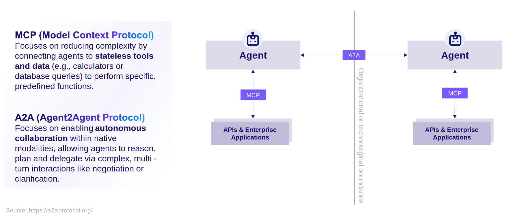

:::info Disclaimer
The Agent Gateway is not yet generally available (GA). As a result, the current architecture supports unidirectional (outbound) communication only.

This reflects a transitional state - key components enabling full bidirectional capabilities are expected to be released soon and will evolve the architecture accordingly.
:::

A robust and scalable AI agent ecosystem relies on standardized communication protocols that enable seamless interoperability between agents and the tools they use. SAP has adopted two open standards, the **Agent2Agent (A2A) protocol** and the **Model Context Protocol (MCP)**, to create a decoupled architecture where agents and tools can be developed, deployed and updated independently. While MCP standardizes the connection between models and external resources, A2A complements it by enabling autonomous, multi-turn collaboration between independent AI agents.

This approach prevents monolithic agent design, promotes reusability and ensures that the SAP agent ecosystem remains open and extensible.

To enable governed, production-grade agentic access, SAP recommends two complementary approaches:

-   **Agent Gateway**, using the A2A protocol, for multi-agent collaboration scenarios where an external client or third-party agent needs to delegate tasks to, or receive results from, SAP-managed agents. It enables secure, standardized communication and task delegation across agents from different vendors and systems.
-   **MCP Gateway in SAP Integration Suite**, for governed, enterprise-grade exposure and consumption of SAP and non-SAP APIs as MCP-compliant tools. It acts as a customer-managed platform covering the full lifecycle from creating MCP servers out of existing APIs and integrations, to securing, monitoring and governing agent access at scale.

The diagram below illustrates how A2A and MCP fit into the overall agent architecture. Joule acts as an A2A client to communicate with external agents, while agents themselves use MCP to discover and consume tools from MCP servers.

## Architecture

### Agent2Agent (A2A) Protocol

The [**Agent2Agent (A2A) protocol**](https://a2a-protocol.org/latest/) is an open standard for communication and collaboration between autonomous AI agents. It enables one agent to delegate tasks to another, inquire about its capabilities and exchange information in a structured manner.

**Key Functions of A2A:**

-   **Agent Integration:** A2A provides the standard contract for integrating externally developed agents (e.g., pro-code agents) into the SAP ecosystem. By exposing an agent as an A2A server, it becomes discoverable and usable by other systems, most notably Joule.
-   **Task Delegation:** It allows for the creation of sophisticated, multi-agent workflows where a primary agent can orchestrate specialized sub-agents to solve a complex problem.
-   **Interoperability:** Because A2A is an open standard, agents built with different frameworks and by different teams or organizations can communicate seamlessly, fostering a diverse and powerful agent landscape.

For pro-code agents, exposing an **A2A-Server endpoint** is the primary mechanism for integrating with Joule. Joule acts as an A2A client, sending requests to the agent and processing its responses according to the A2A-defined contract.

### Model Context Protocol (MCP)

[**Model Context Protocol (MCP)**](https://modelcontextprotocol.io/) is an open standard that defines how AI models and agents can discover, understand and interact with external tools and their surrounding context. It acts as a universal adapter, allowing agents to consume tools—from simple functions to complex APIs—without needing to know their underlying implementation details.

**Key Functions of MCP:**

-   **Tool Discovery:** MCP servers expose a manifest that describes the available tools, their functions and their input/output schemas. This allows an agent to dynamically discover what actions it can perform.
-   **Standardized Interaction:** It provides a consistent way for an agent to call a tool and receive a response, abstracting away the specifics of the tool's implementation (e.g., REST API, OData service, or a simple function).
-   **Decoupling:** By placing tools behind an MCP interface, they can be developed, versioned and deployed independently of the agents that use them. This is critical for maintainability and scalability.

At SAP, MCP is used to provide Joule Agents with semantically enriched access to SAP business capabilities and domain knowledge, including content from SAP Knowledge Graph. For external interoperability between vendors and third-party agents, SAP uses the Agent2Agent (A2A) protocol as the preferred approach, ensuring enterprise-grade security, governance and controlled access.

## Agent Gateway (Inbound)

SAP provides an Agent Gateway that enables external clients and applications to consume Joule Agents through standardized protocols. This represents the **inbound direction** where external systems call into SAP.

The **Agent Gateway** exposes Joule Agents via the A2A protocol with an externally reachable endpoint. This enables third-party AI Agents, applications, partner systems and custom business applications to consume SAP-native agents.

**Key Characteristics:**

-   **External Endpoint:** Accessible via a SAP-managed domain
-   **Protocol Support:** A2A 0.3.0 specification with HTTP+JSON transport
-   **Authentication:** Secured through SAP Cloud Identity Services (IAS) App2App tokens with named user context
-   **Asynchronous Processing:** Supports callback-based responses for long-running agent executions

External clients authenticate using IAS App2App dependencies, invoke a specific Joule scenario by providing capability and scenario identifiers and receive responses either synchronously (task submission confirmation) or asynchronously (via callback URL).

## MCP Gateway in Integration Suite

SAP Integration Suite provides an **MCP Gateway** that enables customers to expose SAP and non-SAP APIs as governed, MCP-compliant tools making them consumable by any AI agent.

This is distinct from SAP's internal use of MCP, where Joule Agents consume SAP business capabilities and Knowledge Graph content directly. The MCP Gateway is a **customer-managed platform** designed for external-facing, governed tool exposure, allowing customers to bring their own API landscape, including SAP APIs, third-party APIs, external MCP servers, and integration flows, under a single governed entry point for agent consumption.

**Key Characteristics:**

-   **Flexible Exposure:** SAP APIs, third-party APIs, external MCP servers, integrations, and data sources can all be exposed as MCP-compliant tools 
-   **Enterprise-Grade Security:** Authentication and authorization based on OIDC, rate limiting, payload protection and traffic management ensure controlled access regardless of the underlying source
-   **Governance and Observability:** Comprehensive monitoring, tracing and analytics provide visibility into how agents consume tools, supporting compliance and adoption governance
-   **Developer and Ecosystem Enablement:** Tools and workflows to manage the full MCP tool lifecycle, from creation and documentation enrichment to discovery and consumption by agents

  
## Bring Your Own Agent (Outbound)

In the **outbound direction**, Joule can call external agents developed using third-party frameworks rather than Joule Studio. This "Bring Your Own Agent" (BYOA) approach enables integration of code-based agents built with any framework that supports the A2A protocol.

Joule prepares an A2A message request using the `message/send` method with a user utterance in accordance with the [Agent2Agent (A2A) Protocol, version 0.3.0](https://a2a-protocol.org/v0.3.0/specification/). Only the `text` message type is currently supported.

**Key Integration Capabilities:**

-   **Synchronous Communication:** Joule expects a response from the agent server within 60 seconds. The agent's response handling is delegated to capability development or scripting within dialog functions.
-   **Asynchronous Communication:** For long-running tasks or when persistent connections are not feasible, Joule supports asynchronous updates using push notifications. The A2A server actively notifies a Joule-provided webhook when significant task updates occur.
-   **Multi-Turn Conversations:** For agents that require runtime context handling to support multi-turn conversations, Joule enables the usage of context and task IDs generated by the agent server. These IDs can be captured from the agent response and stored into runtime variables, then propagated in subsequent agent requests.

To ensure secure inbound communication and validate server updates, an Identity Authentication Service (IAS) App2App trust relationship must be established between Joule and the target agent server.

For detailed action definitions, authentication setup and implementation guidance, see [Bring Your Own Agent](https://help.sap.com/docs/joule/joule-development-guide-ba88d1ec6a1b442098863d577c19b0c0/code-based-agents-bring-your-own-agent) in the Joule Development Guide.

By supporting both inbound (Agent Gateway) and outbound (Bring Your Own Agent) integration patterns, SAP enables true bidirectional A2A communication—allowing external systems to consume SAP agents and Joule to orchestrate external agents seamlessly.

## Simplified Flow

1.  **Agent Invocation:** A user interacts with Joule, which determines that a specific task should be handled by a specialized remote agent.
2.  **A2A Communication:** Joule, acting as an **A2A client**, sends a request to the remote agent's **A2A server** endpoint. The request contains the task details and necessary context.
3.  **Agent Reasoning and Tool Discovery:** The remote agent receives the request and begins its reasoning process. It determines that it needs a specific tool to complete the task. It queries relevant **MCP servers** to discover available tools.
4.  **MCP Tool Invocation:** The agent invokes the required tool via the MCP interface, passing the necessary parameters. The MCP server processes the request and returns the result.
5.  **Task Completion and Response:** The remote agent uses the tool's output to complete its task and formulates a response.
6.  **A2A Response:** The remote agent sends the final response back to Joule via the A2A protocol. Joule then presents the result to the user.

By leveraging A2A and MCP, SAP ensures a flexible and future-proof architecture for AI agents, where components are reusable, maintainable and can evolve independently.

## SAP's Commitment to Open Standards

SAP is advancing AI interoperability through strategic investments in open standards and industry collaboration. By deeply integrating **Agent2Agent (A2A)** and **Model Context Protocol (MCP)** into Joule and the broader SAP Business Technology Platform, SAP ensures that customers benefit from flexible, cross-system AI workflows without vendor lock-in.

**Strategic Approach:**

-   **Agent2Agent (A2A) as the Foundation:** SAP fully embraces A2A as the **preferred standard** for multi-agent collaboration and vendor-to-vendor interoperability. A2A enables Joule Agents to communicate seamlessly with both SAP-native agents and third-party agents across platforms like Google Vertex AI, Microsoft Copilot Studio and AWS Bedrock AgentCore.

-   **MCP for Internal Enrichment:** SAP leverages MCP internally to provide Joule Agents with semantically enriched access to SAP business capabilities, including domain knowledge from SAP Knowledge Graph and business APIs. This ensures agents can reason over authoritative enterprise data with full semantic context.
  
-   **MCP for External Exposure:** SAP Integration Suite's MCP Gateway empowers customers to create, manage and expose their own MCP servers, making SAP and non-SAP APIs, integrations and data sources accessible as governed, MCP-compliant tools for any AI agent to consume.  

-   **Architectural Rationale:** For external interoperability, SAP prioritizes A2A via the Agent Gateway for multi-agent collaboration, and offers the MCP Gateway in SAP Integration Suite for governed tool access across SAP and non-SAP APIs. This design ensures enterprise-grade security, governance and controlled access to SAP systems while maintaining the flexibility of open standards.

SAP's roadmap includes continuous enhancements to both protocols, with significant investments planned through 2026 to expand agent-to-agent collaboration and MCP support for development frameworks.

## Examples
Take a look at the following examples that build upon or implement elements of the Reference Architecture:
- [Reference Implementation for A2A-Compliant Pro-Code Agents on SAP BTP with Joule Integration](https://github.com/SAP-samples/btp-joule-a2a-pro-code-agent): Modular reference implementation covering a full-fledged agentic scenario end to end including Joule Integration via the A2A Protocol.
- [SAP A2A Agent Toolkit Plugin](https://github.com/SAP-samples/joule-a2a-agent-toolkit/): Build, deploy, and connect AI agents to SAP Joule via the A2A (Agent-to-Agent) protocol on BTP Cloud Foundry - all from Claude Code.