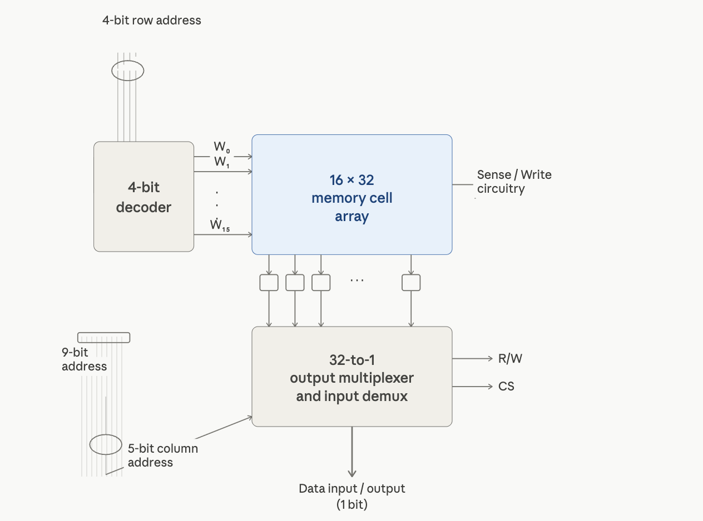

## Overview

**This architecture **describes how ***SAP BTP*** integrates with AWS S3 for secure file storage and data exchange across enterprise systems. It covers connectivity, security, and event-driven processing patterns.

## Architecture Details

SAP BTP connects to [AWS S3](https://aws.amazon.com/free/?trk=78c55dff-53b9-4938-8ed3-d071891360dd&sc_channel=ps&trk=78c55dff-53b9-4938-8ed3-d071891360dd&sc_channel=ps&ef_id=Cj0KCQjwjIPSBhCCARIsABGyK7unpej1tG2_cvOI0hMI20x9nFjSaO2RXiQxZuqHwFuUgeHoXm8LInIaAiMXEALw_wcB:G:s&s_kwcid=AL!4422!3!808712755158!e!!g!!aws!23846236475!198027716802&gad_campaignid=23846236475&gbraid=0AAAAADjHtp-vMgucRd3qpzw1asaXCUI-1&gclid=Cj0KCQjwjIPSBhCCARIsABGyK7unpej1tG2_cvOI0hMI20x9nFjSaO2RXiQxZuqHwFuUgeHoXm8LInIaAiMXEALw_wcB) through the SAP Connectivity Service using destination configurations. The integration flow in SAP Integration Suite handles data transformation and routing between systems.

### Component

- SAP BTP Cloud Foundry Runtime
- SAP Integration Suite
- SAP Connectivity Service
- SAP Private Link Service
- AWS S3 Bucket
- AWS IAM Role
- AWS CloudWatch

### Implementation Steps

1. Create an AWS S3 bucket with appropriate IAM policies
2. Configure SAP Connectivity Service destination pointing to S3
3. Deploy integration flow in SAP Integration Suite
4. Set up event triggers for file upload and download
5. Test the connection from BTP application
6. Monitor using SAP BTP cockpit and AWS CloudWatch
7. Enable server-side encryption on the S3 bucket

## Sample Code

```
const s3 = new AWS.S3();
const params = {
  Bucket: 'sap-btp-bucket',
  Key: 'data/output.json',
  Body: JSON.stringify(payload),
  ContentType: 'application/json'
};
s3.putObject(params, (err, data) => {
  if (err) console.error(err);
  else console.log('Upload successful', data);
});
```

## Service Comparision

| **Service** | **Purpose** | **Cost Model** | **Required** |
| --- | --- | --- | --- |
| AWS S3 | File Storage | Pay per GB | Yes |
| SAP Connectivity Service | Secure tunnel | Included in BTP | Yes |
| SAP Integration Suite | Middleware | Subscription | Yes |
| SAP Private Link | Private Network | Addtional Cost | Optional |

## Important Notes

:::note
Ensure IAM roles follow the least privilege principle when connecting BTP to S3. Only grant the exact permissions needed for the integration scenario
:::

:::warning
Do not store personal data in S3 without server-side encryption enabled.
:::

:::tip
Use SAP Private Link Service if BTP and S3 are both on AWS for lower latency.
:::




