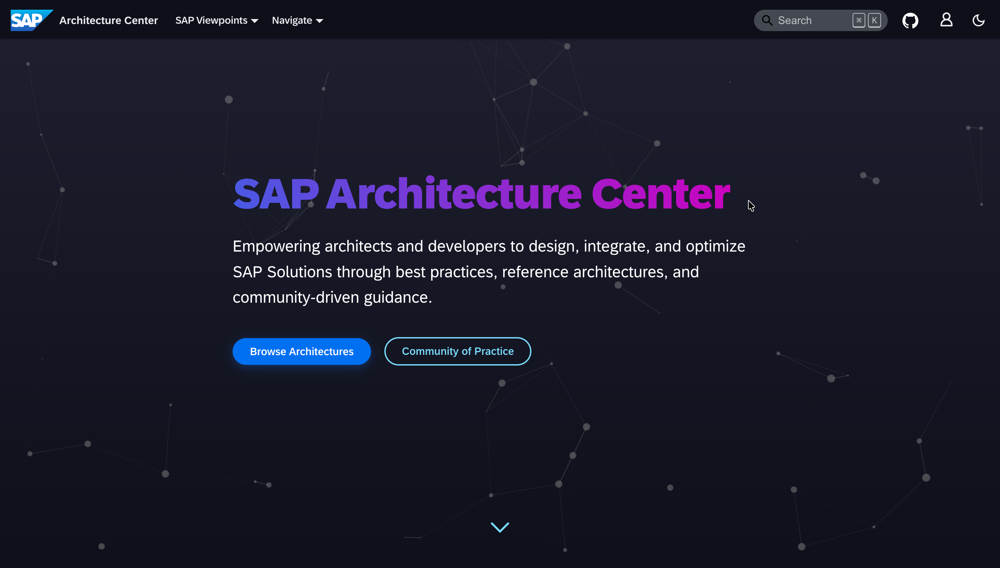

We are pleased to announce the launch of a refreshed SAP Architecture Center. After weeks of development and community feedback, we have reimagined the platform to deliver a more engaging, intuitive, and powerful experience for architects, developers, and SAP professionals worldwide.

<!-- truncate -->

## A Broader Mission for a Changing Landscape

Beyond the visual redesign, the SAP Architecture Center is evolving to reflect a fundamental shift in both our industry and SAP's strategic direction. The pace of technological change, particularly with AI, cloud transformation, and evolving enterprise needs, requires a more dynamic and transparent approach to architectural guidance.

Our mandate has expanded. The Architecture Center is no longer simply a repository of reference architectures. It has become a communication channel between SAP's architectural vision and the global community of practitioners implementing these solutions. We are committed to bringing greater transparency to our work, sharing not just finished architectures but also insights into what we are currently developing, the challenges we are addressing, new research initiatives, and the strategic directions we are pursuing.

This shift recognises that architecture is a continuous conversation, not a set of static documents. As the industry evolves and SAP's strategy adapts to new market realities, the Architecture Center will serve as a living platform where these changes are communicated clearly, openly, and in a way that helps you make informed decisions about your own architectural choices.

## Comprehensive Reference Architectures

The platform now hosts **30** reference architectures across **104** unique documents, and the external version of the [AI Golden Path](/docs/ai-golden-path). Each architecture provides detailed guidance on integrating SAP solutions with cloud providers and technology partners.

Recent additions include practical implementations for:

- [**Agentic AI & AI Agents**](/docs/ref-arch/ca1d2a3e) covering how to build, integrate and orchestrate AI agents on SAP BTP using low-code approaches with Joule Studio, pro-code development with SAP Cloud SDK for AI, and Agent2Agent (A2A) interoperability.
- [**Integrating and Extending Joule**](/docs/ref-arch/06ff6062dc) exploring enterprise integration with SAP S/4HANA and SAP SuccessFactors, building custom skills and agents with Joule Studio, and extending Joule's capabilities across your landscape.

## Community-Driven Content

One of our core principles remains unchanged: the SAP Architecture Center thrives because of community contributions. The new Quick Start (coming soon) will make it easier than ever to contribute your expertise through an enhanced GitHub-based workflow. We have refined the contributor experience with better documentation, clearer guidelines, and streamlined processes for submitting new architectures or enhancing existing ones.

Our community section now provides comprehensive guides for getting started, including Visual Studio Code integration, architecture modelling guidelines, and best practices for creating diagrams and documentation. Whether you are proposing your first reference architecture or refining an existing one, the path forward is clearer.

## What This Means for You

Whether you are designing a new SAP integration, planning a cloud migration, or exploring how to implement AI capabilities in your enterprise applications, the new SAP Architecture Center provides:

- Clear, actionable guidance based on real-world implementations
- Detailed architectural patterns with diagrams and code samples
- Integration strategies for SAP products with hyperscaler services
- Best practices from SAP experts and community contributors
- Regular updates reflecting the latest SAP innovations

## Looking Forward

This release represents a significant milestone, but it is just the beginning. As part of our expanded mandate, we are committed to bringing greater transparency to our architectural work. You will see more frequent updates about emerging patterns, work-in-progress architectures, and strategic initiatives we are exploring. The Architecture Center will serve as your window into how SAP is thinking about and addressing the architectural challenges facing modern enterprises.

We are committed to continuously improving the platform based on your feedback and contributions. The SAP Architecture Center will continue to evolve as a living resource that grows with the SAP ecosystem, reflecting both the rapid pace of technological change and our evolving strategy.

We encourage you to explore the new platform, discover reference architectures relevant to your work, and consider joining our Community of Practice. Your expertise and real-world experience make this resource valuable for the entire SAP community. Through this enhanced transparency, we aim to create a stronger connection between SAP's architectural direction and the practical needs of the professionals implementing these solutions.

## Get Involved

The SAP Architecture Center is open source and welcomes contributions from architects, developers, and SAP professionals worldwide. Visit our [Community of Practice](https://architecture.learning.sap.com/community/intro) page to learn how you can:

- Contribute new reference architectures
- Enhance existing documentation
- Share implementation experiences
- Participate in discussions (via SAP Community)
- Help shape the future of SAP architecture guidance

Thank you to all the contributors who have made this release possible. Your dedication to sharing knowledge and best practices benefits the entire SAP community and helps organisations worldwide build better solutions.

## Celebrating Community Contributions

We would like to highlight the contributions from our community partners who have enriched the Architecture Center with their real-world expertise. These contributions demonstrate the power of collaborative knowledge-sharing and bring valuable practitioner insights to our growing library of reference architectures.

We extend our sincere thanks to **Fortinet** for contributing [Log-Driven Security Operations with SAP Enterprise Threat Detection and SIEM/SOAR Platforms](/docs/ref-arch/d6e703646d), and to [@randomstr1ng](https://github.com/randomstr1ng) for authoring this comprehensive security architecture that bridges SAP-native threat detection with enterprise security operations.

Our appreciation goes to **SD Worx** for sharing [SAP SuccessFactors Suite](/docs/ref-arch/5Hlvofqg), and to [@arjenvanhooydonk](https://github.com/arjenvanhooydonk) for creating this detailed overview of the SuccessFactors ecosystem that helps organisations understand the full employee lifecycle platform.

We are grateful to **Glencore** for contributing [Transitioning Architectures from SAP NetWeaver](/docs/ref-arch/9a5f7b59dc), and to [@abklgithub](https://github.com/abklgithub) for providing this essential guidance on navigating the transition from NetWeaver-based products as they approach end-of-maintenance in 2027.

These contributions exemplify the collaborative spirit that makes the SAP Architecture Center a truly community-driven resource. We invite more partners and practitioners to share their architectural insights and help shape the future of enterprise architecture guidance.

We look forward to building the future of SAP architecture together.

---

The entire platform is available as open source at [github.com/SAP/architecture-center](https://github.com/SAP/architecture-center).
