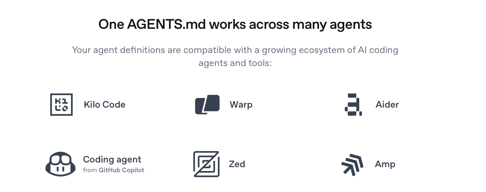
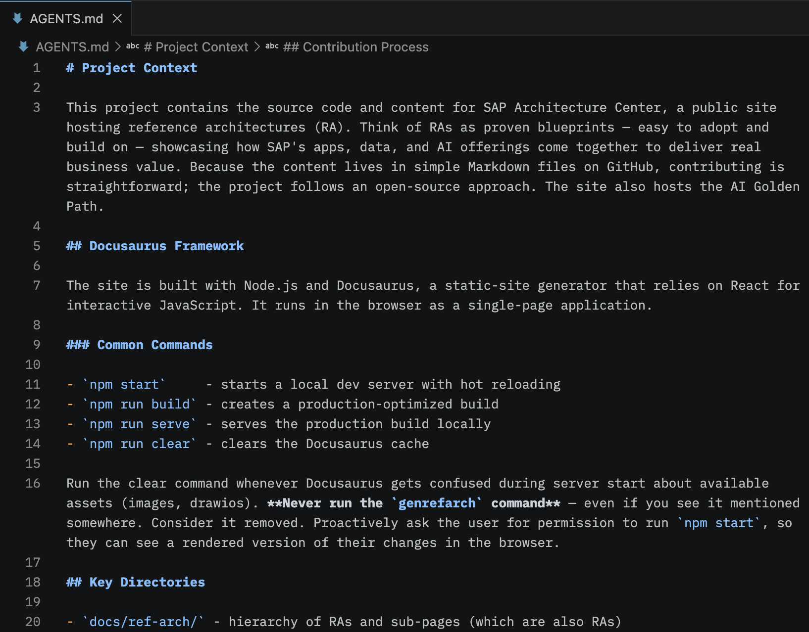

We've been working with AI (coding) agents for a while now to develop and maintain the SAP Architecture Center site. Our community has picked up on them too. Letting an AI agent put the final touches on new reference architecture content may sound trivial, but it's very common nonetheless.

So when we heard of `AGENTS.md` we knew it was something worth exploring.

<!-- truncate -->

The idea of grounding the agent with basic context about the Architecture Center for more immediate, project-aligned answers sounded promising. As of recently, the repository on GitHub has a new [AGENTS.md](https://github.com/SAP/architecture-center/blob/dev/AGENTS.md), which tries to work towards that goal.

## The AGENTS.md Standard

Think of `AGENTS.md` as a `README.md` dedicated not to humans, but to AI agents. It's a new standard developed under the [Agentic AI Foundation](https://aaif.io). Written in simple Markdown, the file provides the agent with context about your project specifics so that it keeps them in mind while implementing features, testing them, answering questions, and so on.

An `AGENTS.md` often includes a short project description, outlines the development framework in use, lists common commands, and documents conventions for file names and code style. **But it certainly doesn't have to.** In the end it's about adding whatever makes the agent reliably pick up your custom, nuanced project specifics and produce the desired results.

Of course, the standard only has a benefit if it's being adopted. Luckily, more and more AI agent providers (opencode, OpenAI Codex, and GitHub Copilot among them) have already done so. They look for an `AGENTS.md` file and load the instructions into the agent's starting context for every new session. Ideally you write the instructions once and they apply across many different agents.

## Our Initial AGENTS.md

The new `AGENTS.md` in the repository checks many of the boxes from above and is hand-written for the most part. From it the agent knows that while it's expected to assist in writing technical and sharp content, generating new content from scratch cannot be endorsed.

Overall the current version is tailored especially to new content contributors. Check out our new page on [AI agents](/docs/community/get-started-ai-agents) in the community of practice for examples on what to ask. In most cases no additional setup is required. You can ask the agent to walk you through the contribution process, for instance. It also has a `create-ref-arch-skeleton` skill to scaffold a new reference architecture in terms of files and folders, which you can optionally trigger via a slash command.

The current `AGENTS.md` is by no means set in stone. It's meant to evolve continuously alongside the project.

## Call for Action

If you're new here, there's never been a better time to clone our repository and start exploring it through your AI agent of choice, and perhaps even contribute to it. And should you already be a seasoned contributor, let us know how you're working with an AI agent so we can tweak `AGENTS.md` accordingly.

Or even better, include changes to `AGENTS.md` in your usual content contributions. There's a good chance it will be relevant to others as well. We're always looking for new ways to work with AI agents. With that, we hope you found this interesting. Until next time!
